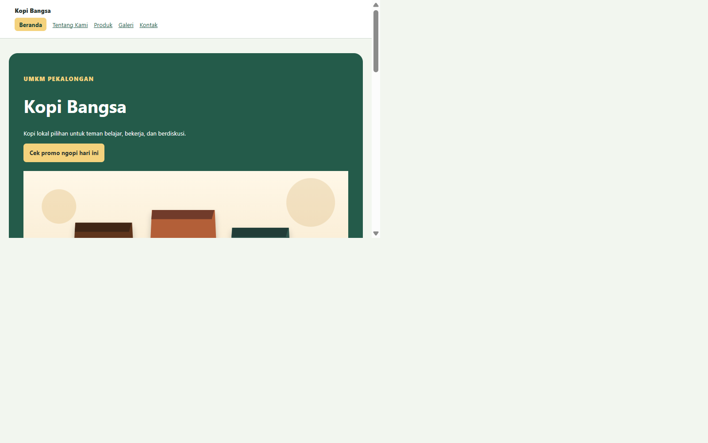
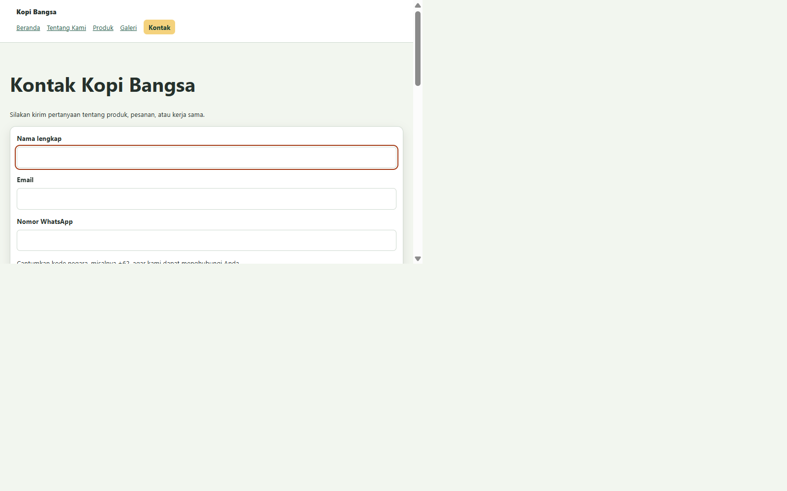

# PW1-P05-04: Tugas dan Worksheet CSS Fundamental dan Design Token

## Ringkasan Checkpoint

| Checkpoint | Commit | Catatan |
| --- | --- | --- |
| Praktikum terbimbing P05-02 | `194afa7` | Baseline, token, komponen, dan focus-visible. |
| Checkpoint tema sebelum tugas mandiri | `301f5c9` | Polish CTA terracotta dan madu. |
| Tugas mandiri P05-04 | `7e9378d` | Variasi tema Pinus dan Gula Aren. |

## Tema Akhir: Kopi Bangsa Rempah dan Madu

Tema checkpoint P05 sebelum tugas mandiri memadukan terracotta dan espresso untuk ajakan bertindak, aksen madu untuk CTA hero, serta hijau untuk status sukses. Nilai warna fungsional dipusatkan pada custom properties.

| Token | Sebelum | Sesudah | Peran |
| --- | --- | --- | --- |
| `--color-primary` | `#6f3b1f` | `#a6401b` | Identitas utama, link, hero, dan tombol umum |
| `--color-primary-strong` | `#4b2715` | `#7c2d12` | Hover dan teks penekanan |
| `--color-text` | `#2f2118` | `#30231e` | Teks utama |
| `--color-muted` | `#6b5b52` | `#69574e` | Keterangan sekunder |
| `--color-surface-soft` | `#fff8f0` | `#fff7ed` | Latar halaman dan permukaan lembut |
| `--color-border` | `#dccbbc` | `#e8d4bf` | Batas kontrol dan komponen |
| `--color-focus` | `#1d4ed8` | `#005fcc` | Indikator fokus |
| `--color-success` | Baru | `#216a46` | Border status pengiriman berhasil |
| `--color-success-soft` | Baru | `#e8f4eb` | Latar status pengiriman berhasil |

Token pendukung yang turut direvisi: `--color-accent`, `--color-accent-secondary`, `--color-selected-surface`, `--color-highlight`, `--color-highlight-hover`, dan `--shadow-card`. Tombol umum memakai terracotta dengan teks putih, sedangkan CTA hero memakai aksen madu dengan teks gelap.

Token radius baru adalah `--radius-lg: 1.25rem` dan `--radius-xl: 1.75rem`. `.product-card` memakai `--radius-lg`, sedangkan `.hero` memakai `--radius-xl`. Token jarak `--space-6: 2.5rem` digunakan oleh `.page` dan `.hero`.

Warna `--color-primary` dipakai pada teks tautan navigasi dan latar `.hero`; nilai hasil komputasi keduanya adalah `rgb(166, 64, 27)`. Rasio kontras teks putih terhadap warna primary adalah 6.23:1.

## Variasi Tema Tugas Mandiri: Pinus dan Gula Aren

Variasi tugas mandiri mengganti aksen terracotta-madu menjadi hijau pinus dengan aksen gula aren. Nilai token disimpan di `:root` dan diterapkan melalui custom properties.

| Token | Sebelum | Sesudah | Peran |
| --- | --- | --- | --- |
| `--color-primary` | `#a6401b` | `#245b4a` | Tautan navigasi, hero, dan tombol umum |
| `--color-primary-strong` | `#7c2d12` | `#173f34` | Hover tautan dan tombol |
| `--color-text` | `#30231e` | `#26312c` | Teks utama |
| `--color-muted` | `#69574e` | `#55665d` | Teks keterangan |
| `--color-surface-soft` | `#fff7ed` | `#f2f6ef` | Latar halaman dan tabel |
| `--color-border` | `#e8d4bf` | `#ced9cf` | Batas form dan komponen |
| `--color-focus` | `#005fcc` | `#a33b16` | Focus indicator |
| `--color-accent` | `#e56b32` | `#d46a3c` | Aksen card |
| `--color-highlight` | `#ffe08a` | `#f4d27d` | Permukaan CTA hero |
| `--color-success` | `#216a46` | `#17613e` | Border pesan preview berhasil |
| `--color-success-soft` | `#e8f4eb` | `#e7f2e9` | Latar pesan preview berhasil |

Pasangan radius `--radius-card: 1rem` dan `--radius-feature: 1.5rem` dipakai oleh `.product-card` dan `.hero`. Navigasi dan hero berbagi token warna `--color-primary`; screenshot kedua komponen terlampir di bagian evidence.

## Bukti Praktikum Terbimbing P05-02

| ID | Bukti | Hasil pemeriksaan | Status |
| --- | --- | --- | --- |
| PW1-P05-E01 | Koneksi stylesheet | Kelima halaman utama memuat satu `css/style.css` dan telah dibuka di browser. | Lulus |
| PW1-P05-E02 | Baseline dan token | Nilai hasil komputasi `box-sizing` adalah `border-box`; token warna, jarak, radius, dan bayangan tersedia. | Lulus |
| PW1-P05-E03 | Perbandingan sebelum/sesudah | Tampilan sesudah diperiksa di browser. Screenshot sebelum tidak diambil karena stylesheet sudah memiliki perubahan lokal sebelum praktikum P05-02; pasangan screenshot belum diarsipkan. | Sebagian |
| PW1-P05-E04 | Tipografi dan komponen | Body memakai system font berukuran `1rem`; hero, card, tabel, form, dan media tampil setelah refactor. Screenshot belum diekspor sebagai berkas. | Sebagian |
| PW1-P05-E05 | Focus-visible | Navigasi keyboard menampilkan outline pada skip link dan input `#nama`; CSS menetapkan outline 3px dengan offset. | Lulus |
| PW1-P05-E06 | Gaya dan cascade | Aturan `button` dan `.hero button` diperiksa melalui CSSOM. Panel Styles DevTools tidak tersedia di browser tool, sehingga screenshot panel belum dilampirkan. | Sebagian |
| PW1-P05-E07 | Nilai hasil komputasi | Font, `box-sizing`, radius, bayangan, warna fokus, dan warna akhir tombol diperiksa di browser. Screenshot panel Computed DevTools belum dilampirkan. | Sebagian |
| PW1-P05-E08 | Commit praktikum | Fondasi CSS dan design token dicatat pada commit `194afa7` (`feat: bangun fondasi css dan design token`). | Lulus |

## Bukti Tugas Mandiri

| Bukti | Catatan | Status |
| --- | --- | --- |
| Daftar token tema | Token warna dan pasangan radius baru tercatat pada tabel variasi tema di atas. | Lulus |
| Penggunaan token bersama | Navigasi dan `.hero` memakai `--color-primary`; keduanya terlihat pada screenshot di bagian lampiran. | Lulus |
| Keterbacaan | Kontras computed: link biasa/putih 7.86:1; link aktif/permukaan highlight 7.99:1; teks putih/hero 7.86:1; eyebrow madu/hero 5.38:1; teks utama/latar lembut 12.33:1; teks muted/latar lembut 5.57:1; teks CTA hero/highlight 9.22:1; teks status/latar sukses 11.73:1; border status/latar sukses 6.49:1. Semua pasangan teks memenuhi WCAG AA untuk teks normal. | Lulus |
| Fokus keyboard | Tab mencapai skip link, tautan navigasi, lalu input `#nama`; outline `:focus-visible` terlihat, warna `#a33b16`, deklarasi 3px dengan offset 3px. Kontras warna fokus terhadap latar lembut 6.01:1. Screenshot input fokus terlampir di bagian bawah. | Lulus |
| Konflik cascade dan specificity | Konflik: `button { background: var(--color-primary) }` (specificity `(0,0,1)`) berlawanan dengan `.hero button { background: var(--color-highlight) }` (`(0,1,1)`). Selector `.hero button` menang; hasil computed tombol hero `rgb(244, 210, 125)`. Screenshot panel Styles/Computed DevTools masih perlu ditambahkan manual. | Catatan ada; screenshot pending |
| Challenge status sukses | Submit valid menampilkan teks eksplisit `Preview berhasil dibuat.` melalui `#preview-form[aria-live="polite"]`; `--color-success` memberi border dan `--color-success-soft` memberi latar. Status tidak bergantung pada warna saja. | Lulus |
| Commit tugas mandiri | `7e9378d` — `feat: add pinus and palm sugar P05-04 theme`; commit implementasi terpisah dari evidence. | Lulus |

## Validasi Regresi dan Batas Materi

- Lima halaman utama memuat stylesheet; gambar galeri termuat, tabel tampil, dan audio memiliki kontrol serta tidak melaporkan error media.
- Tombol promo tetap bekerja.
- Submit form kosong ditahan validasi native; preview tidak diberi kelas sukses.
- Submit valid memperbarui preview dan menerapkan status sukses.
- Focus indicator terlihat pada link dan input form.
- Tidak ada deklarasi Flexbox, Grid, media query, atau `outline: none` di `css/style.css`.
- Diagnostik CSS/JavaScript dan `git diff --check` bersih pada pemeriksaan tugas.

## Bukti Screenshot Tugas Mandiri

- Dua komponen dengan token sama: navigasi dan hero memakai `--color-primary`.

- Focus-visible keyboard pada input `#nama`:

- Lampiran yang masih perlu ditambahkan:

- Screenshot perbandingan sebelum dan sesudah.
- Satu screenshot panel Styles/Computed DevTools yang membuktikan konflik cascade pada tombol hero.